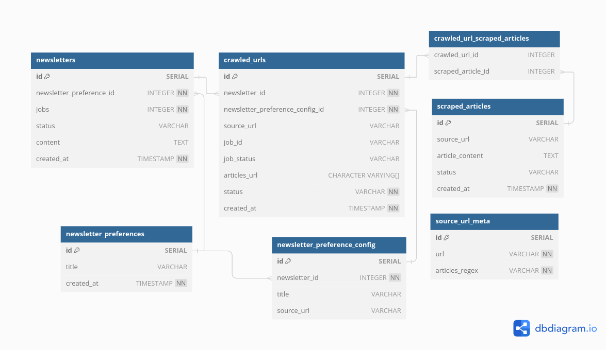
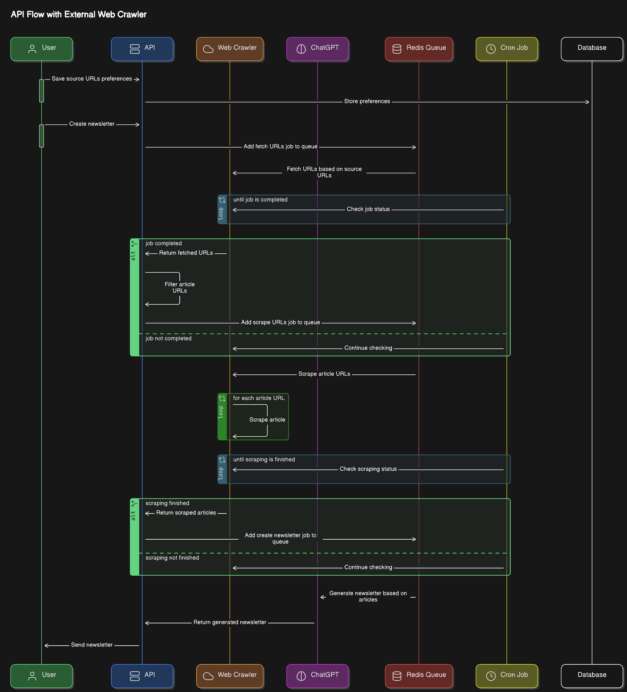

## Dependência

- O [firecrawl](https://github.com/mendableai/firecrawl/blob/main/SELF_HOST.md) precisa estar rodando na sua máquina.

Clone o repositório e crie uma cópia do `.env.example` para `.env`.

```bash
git clone https://github.com/mendableai/firecrawl.git
cd firecrawl
cp ./apps/api/.env.example ./.env
```

Altere as seguintes variáveis no .env

```yml
USE_DB_AUTHENTICATION=false
REDIS_URL=redis://redis:6379
```

Rode o comando para inicia-lo

```bash
docker compose up
```

## Rodar o projeto

- Clone o repositório

```bash
git clone https://github.com/NahtanN/diy-newsletter.git
cd diy-newsletter
cp .env.example .env
```

- Adicione sua chave de API do ChatGPT

```yml
OPENAI_API_KEY=sua-chave
```

- Instale as dependências

```bash
npm i
```

- Suba os containers (banco postgres e redis)

```bash
docker compose up -d
```

- Rode o projeto

```bash
npm run start:dev
```

A API estará rodando na porta 3000 (você pode alterar no .env).
A documentação swagger estará disponível na rota `http://localhost:3000/docs#/`. No diretório `/extra`, você encontra o arquivo do Insomnia.
Existem duas instâncias do redis, uma do Firecrawl e outra da api. Você pode consultar as filas através dos links:

- Firecrawl `http://localhost:3002/admin/@/queues/queue/web-scraper`
- API `http://localhost:3000/queues/`

## Banco de Dados

- O banco de dados utilizado foi o Postgres. Ele possui a seguinte estrutura
  
- Você encontrar o arquivo de configuração do [db diagram](https://dbdiagram.io/) no diretório `/extra`

## Diagrama


